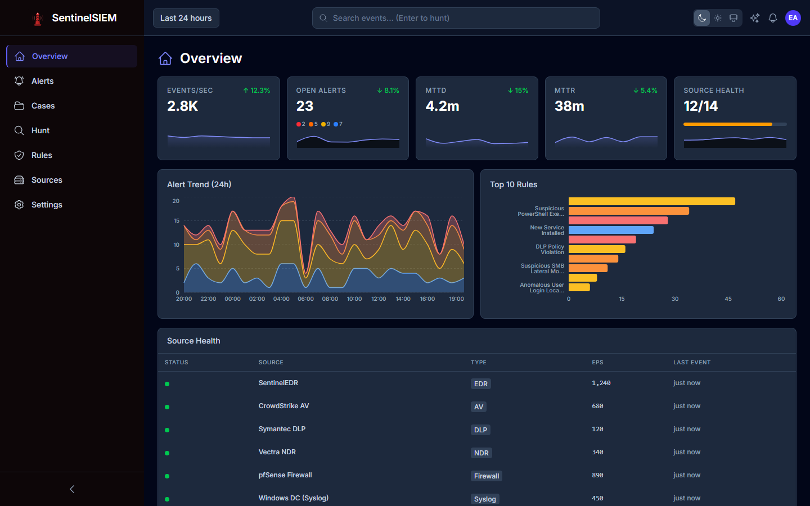
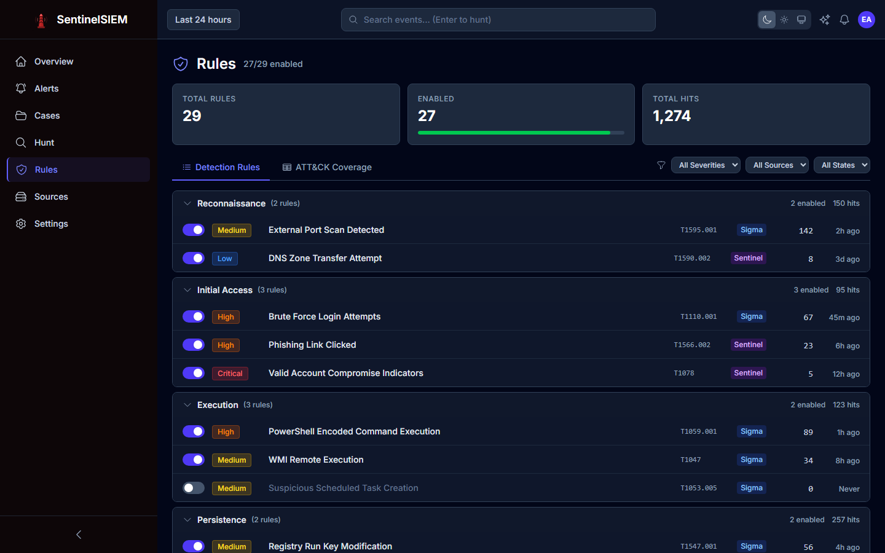
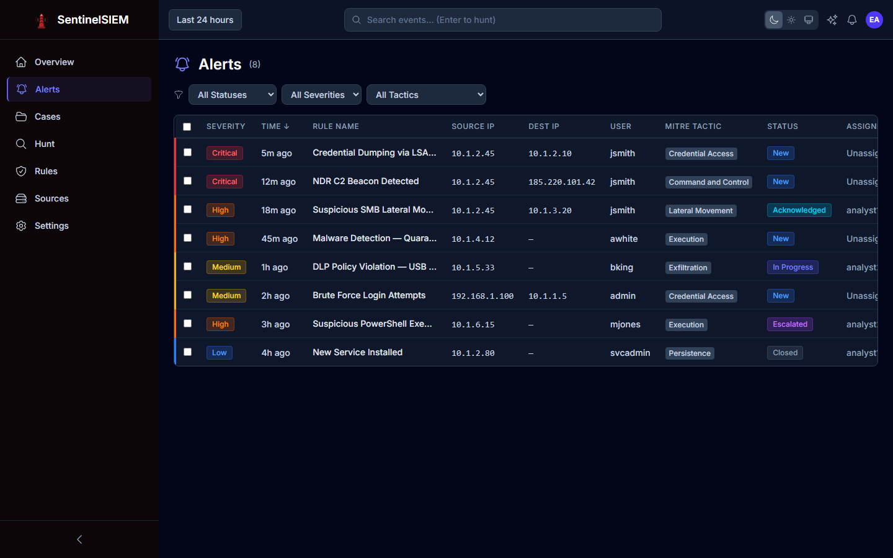
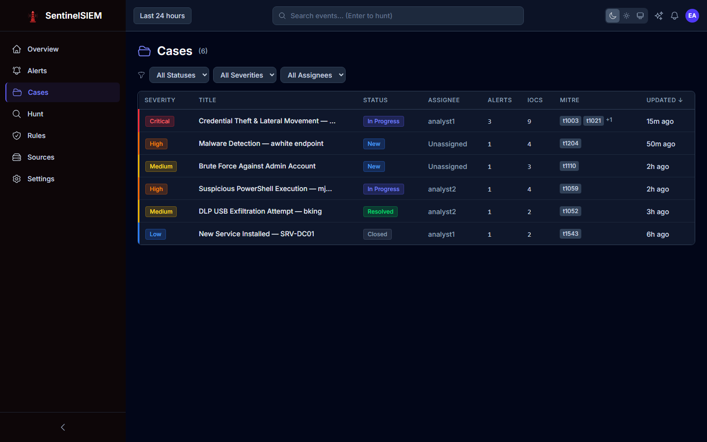

# SentinelSIEM

A proof-of-concept Security Information & Event Management platform built in Go, backed by Elasticsearch. Designed as the central detection and investigation brain for the Sentinel security portfolio.



## Why SentinelSIEM?

Most SIEM platforms are either expensive commercial products with opaque internals, or open-source projects that require stitching together a dozen loosely coupled tools. SentinelSIEM takes a different approach:

- **Single-binary simplicity.** Each component is a standalone Go binary — no JVM, no Python runtime, no container orchestration required. Build it, copy it, run it.
- **Native Sigma support.** Detection rules use [Sigma](https://github.com/SigmaHQ/sigma), the open standard used by thousands of detection engineers worldwide. Ship with 3000+ community rules on day one. No proprietary rule language to learn.
- **ECS-first normalization.** Every event from every source is normalized to the [Elastic Common Schema](https://www.elastic.co/guide/en/ecs/current/index.html) before it hits storage. Cross-source correlation works because the data model is consistent, not because you wrote custom joins.
- **Cross-portfolio correlation.** SentinelSIEM natively correlates across EDR, AV, DLP, Windows, and syslog sources. A malware detection on one host plus a DLP policy violation on the same user within 15 minutes? That's one alert, not two tickets in two consoles.
- **Built-in case management.** Alert escalation, observable tracking, analyst collaboration, and resolution metrics without an external tool like TheHive or ServiceNow.
- **Transparent and hackable.** The entire codebase is readable Go with minimal dependencies. If you want to add a parser, write a struct that implements one interface. If you want to add a detection, write a YAML file.

SentinelSIEM is designed for security teams that want to understand their tooling, not just operate it.

## What It Does

SentinelSIEM ingests telemetry from multiple security sources, normalizes events to ECS, evaluates Sigma detection rules in real time, and provides a query interface for threat hunting — all through a React-based dashboard with built-in case management.

### Data Sources

| Source | Protocol | Status | Description |
|--------|----------|--------|-------------|
| Sentinel EDR | JSON/HTTP | Implemented | Endpoint behavior telemetry (process, network, registry, file events) |
| Sentinel AV | JSON/HTTP | Implemented | Malware scan results, quarantine actions, real-time blocks |
| Sentinel DLP | JSON/HTTP | Implemented | Data classification, policy violations, removable media events |
| Sentinel NDR | JSON/HTTP | Implemented | Network detection & response (session, DNS, HTTP, TLS, SMB, Kerberos, etc.) |
| Windows Event Logs | WEF/HTTP | Implemented | Security, Sysmon, and system events via XML or Winlogbeat JSON |
| Syslog | TCP/UDP/TLS | Implemented | Firewalls, Linux auditd, network devices (RFC 5424 & 3164) |

### Ingestion Pipeline

- **HTTP endpoint** (`/api/v1/ingest`) — NDJSON and JSON array batch support, API key authentication, per-IP rate limiting
- **WEF endpoint** (`/api/v1/ingest/wef`) — Windows Event Forwarding with auto-detection of XML vs JSON payloads, BOM handling, batch XML splitting
- **Syslog listener** — TCP (newline-delimited + octet-counting framing), UDP, and TLS on configurable ports with connection limits and idle timeouts
- **Normalization engine** — Per-source-type parsers registered at startup, routing by `source_type` field. Extensible via the `normalize.Parser` interface
- **Syslog sub-parsers** — YAML-driven regex configs for structured field extraction (ships with iptables, auditd, generic KV). Regexes pre-compiled at startup using Go's RE2 engine (linear-time, no ReDoS)

### Detection Engine

- **Sigma rules** — Native parsing and evaluation of the open-standard YAML detection format
- **Single-event rules** — Field matching with full modifier support (`contains`, `re`, `cidr`, `base64`, `all`, `gt`, `gte`, `lt`, `lte`, etc.)
- **Correlation rules** — Multi-event patterns: `event_count` (threshold), `value_count` (distinct values), `temporal` (ordered sequences within time windows)
- **Cross-portfolio detections** — Rules that correlate across EDR + AV + DLP sources to detect multi-stage attack chains
- **Hot-reload** — File watcher + CLI trigger for zero-downtime rule updates



### Alert Triage

Severity-coded alert queue with MITRE ATT&CK tactic tagging, source/destination IP context, status workflow (New → Acknowledged → In Progress → Escalated → Closed), and bulk actions for efficient triage.



### Case Management

Built-in incident response workflow: alert escalation, observable extraction (IPs, hashes, domains, usernames), analyst collaboration via timeline, MITRE ATT&CK tagging, and resolution tracking with detection efficacy metrics (MTTD/MTTR).



## Architecture

```
[Sentinel EDR] ─┐
[Sentinel AV]  ─┤
[Sentinel DLP] ─┤─→ [sentinel-ingest] → [sentinel-normalize] → [sentinel-store (ES)]
[Sentinel NDR] ─┤                                ↓
[Windows WEF]  ─┤                       [sentinel-correlate]
[Syslog]       ─┘
                                                 ↓
                                        [alerts + cases in ES]
                                                 ↓
                                        [sentinel-query / dashboard]
```

| Component | Description |
|-----------|-------------|
| `sentinel-ingest` | HTTP/syslog/WEF listener, API key auth, NDJSON batch support, TLS syslog |
| `sentinel-normalize` | ECS normalization engine with per-source-type parsers and YAML sub-parsers |
| `sentinel-store` | Elasticsearch client — index templates, ILM, bulk indexing, dead letter queue |
| `sentinel-correlate` | Real-time Sigma rule engine with correlation state management |
| `sentinel-query` | REST API server, query language → ES DSL translation, serves dashboard |
| `sentinel-cli` | Management CLI — user/key admin, rules validate/update/reload, ingest test/replay, diagnostics, ad-hoc queries |
| `sentinel-dashboard` | React SPA — alert triage, cases, threat hunting, rule management, source health |
| `sentinel-auth` | User auth service — JWT, TOTP MFA, RBAC, login rate limiting, first-run setup |

## Project Structure

```
├── cmd/
│   ├── sentinel-ingest/       # HTTP/syslog ingestion server
│   ├── sentinel-correlate/    # Sigma rule evaluation engine
│   ├── sentinel-query/        # Query API + dashboard server
│   └── sentinel-cli/          # Management CLI
├── internal/
│   ├── common/                # Shared types (ECS event, auth, metrics)
│   ├── config/                # TOML config loading
│   ├── store/                 # Elasticsearch client wrapper
│   ├── ingest/                # HTTP/syslog/WEF listeners, pipeline
│   ├── normalize/parsers/     # Per-source-type ECS parsers
│   ├── correlate/             # Sigma rule engine + logsource mapping
│   ├── query/                 # Query parser, ES translator, REST API
│   ├── cases/                 # Case management service
│   ├── sources/               # Source configuration + snippets
│   ├── alert/                 # Alert pipeline + retry queue
│   ├── auth/                  # JWT, MFA, RBAC, rate limiting, user management
│   ├── lifecycle/             # Graceful shutdown manager
│   └── metrics/               # Prometheus instrumentation (18 metrics)
├── rules/                     # Sigma detection rules
│   ├── sigma_curated/         # Curated SigmaHQ community rules
│   └── sentinel_portfolio/    # Cross-source correlation rules
├── parsers/                   # Logsource maps + syslog sub-parser YAML configs
├── scripts/                   # Install, demo, dev, teardown, cert gen
├── web/                       # React dashboard
│   ├── tests/e2e/             # Playwright E2E browser tests
│   ├── tests/screenshots/     # Playwright documentation screenshot capture
│   └── docs/screenshots/      # Captured page screenshots
├── docs/                      # Grafana dashboard JSON
└── tests/                     # Integration + benchmark tests
```

## Tech Stack

**Backend:** Go 1.22+ with `go-elasticsearch`, `chi` (routing), `zap` (logging), `gopkg.in/yaml.v3`

**Storage:** Elasticsearch 8.x with ECS-compliant index templates and ILM policies

**Frontend:** React 19, Vite 6, Tailwind CSS v4, TanStack Table + Query, Recharts, Nivo (ATT&CK heatmap), CodeMirror 6 (query editor), Zustand, Headless UI

**Auth:** JWT (access + refresh tokens), bcrypt password hashing, TOTP MFA (RFC 6238) with AES-256-GCM encrypted secrets, RBAC (admin, soc_lead, detection_engineer, analyst, read_only), login rate limiting

**Observability:** Prometheus metrics (18 across 6 subsystems), Grafana dashboard (16 panels), dead letter queue, alert retry queue

**Testing:** Go `testing` (unit + integration, 850-event replay validation), load test (1000 eps × 10 min), Playwright (E2E browser tests)

## Getting Started

### Prerequisites

- Go 1.22+
- Docker & Docker Compose (for Elasticsearch)
- Node.js 18+ (for dashboard development)
- Make

### Quick Start

```bash
make demo                     # Build, start services, create demo users, replay fixture data
```

This runs the full setup: builds binaries, starts Elasticsearch via Docker, creates an admin account and 5 demo analyst accounts via first-run setup, replays all fixture datasets, and prints access URLs and credentials.

When finished:

```bash
make demo-clean               # Disable demo users, delete all indices, stop services
```

### Build

```bash
make build       # Compiles all binaries to bin/
make test        # Runs tests
make lint        # Runs go vet
make clean       # Removes bin/ directory
```

### Run

```bash
docker compose up -d                            # Start Elasticsearch + Kibana
.\bin\sentinel-ingest.exe --config sentinel.toml  # Start ingestion server
.\bin\sentinel-query.exe --config sentinel.toml   # Start query API (separate terminal)
```

### Dashboard Development

```bash
cd web
npm install                   # Install frontend dependencies
npm run dev                   # Start Vite dev server (port 3000)
```

Requires `sentinel-query` to be running on port 8081 (Vite proxies API requests).

### Scripts

| Script | Make Target | Description |
|--------|-------------|-------------|
| `scripts/install.sh` | `make install` | Build binaries, start Docker, apply ES templates, create admin user, print credentials |
| `scripts/demo.sh` | `make demo` | Full demo: install + 6 analyst accounts + replay all fixtures + verify |
| `scripts/demo-clean.sh` | `make demo-clean` | Teardown: disable demo users, delete all indices, stop services |
| `scripts/dev.sh` | `make dev` | Hot-reload development mode with ingest + query + Vite |
| `scripts/gen-certs.sh` | — | Generate self-signed TLS certs for syslog development |
| `scripts/wait-for-es.sh` | — | Block until Elasticsearch is healthy (used by install.sh) |

### Integration Tests

SentinelSIEM includes a comprehensive integration test suite that validates the full detection pipeline end-to-end — no Elasticsearch or running servers required.

```bash
# Run all integration tests
go test ./tests/integration/ -v

# Run just the 850-event replay test
go test ./tests/integration/ -run TestReplay850Events -v

# Run the full test suite (unit + integration)
go test ./... -v
```

**Test suite breakdown:**

| Test | What it validates |
|------|-------------------|
| `TestReplay850Events` | 850 synthetic ECS events (40 malicious + 810 benign) evaluated against 50 Sigma rules. Asserts exactly 40 alerts and zero false positives across all 6 source types. |
| `TestEngineStats` | Verifies all project rules load, compile, and map to logsource buckets. Currently: 74 compiled rules, 16 logsource buckets, 0 compile errors. |
| `TestEachRuleCategory` | Fires at least one rule per logsource category (process_creation, sentinel_av, sentinel_dlp, sentinel_ndr, windows_security, syslog_linux). |
| `TestBenignEventsZeroAlerts` | Dedicated false-positive regression test — 810 benign events must produce 0 alerts. |

The 40 malicious events cover the full attack surface:

- **15 process creation** — Mimikatz, PsExec, encoded PowerShell, certutil, WMIC, rundll32, mshta, whoami, net.exe, BITSAdmin, schtasks, download cradles, regsvr32, reg hive dump, Office child process
- **4 antivirus** — Trojan, webshell, Cobalt Strike beacon, hacktool/PUA
- **5 data loss prevention** — PCI exfil, PII violation, source code upload, USB restricted data, financial data leak
- **6 network detection** — C2 long session, large outbound transfer, Tor connection, suspicious port, DNS suspicious TLD, high packet beaconing
- **6 Windows events** — Brute force, account creation, privilege escalation, log cleared, service installed, RDP logon
- **4 Linux/syslog** — SSH brute force, sudo escalation, crontab modification, unauthorized root login

### Load Test & Benchmarks

```bash
# 30-second sustained load test (1000 events/sec, no ES required)
go test ./tests/benchmark/ -v -run TestLoadTest -loadduration=30s -timeout 2m

# Full 10-minute load test
go test ./tests/benchmark/ -v -run TestLoadTest -loadduration=10m -timeout 15m

# Per-batch and per-rule-eval benchmarks
go test ./tests/benchmark/ -bench=. -benchmem
```

Assertions: ≥90% target EPS, p95 latency <5s, rule eval p95 <10ms, heap <500MB, no event loss.

### E2E Tests

```bash
cd web
npx playwright install        # Install browser binaries (first time)
npx playwright test           # Run all E2E tests (headless)
npx playwright test --headed  # Run with visible browser
```

Requires the backend (`make run-query`) and Elasticsearch to be running. Tests cover auth flows, page rendering, navigation, theme persistence, and interactive features across 8 test suites (35 tests).

#### Documentation Screenshots

Capture full-page screenshots of every dashboard view at 1440x900 for documentation:

```bash
cd web
npm run screenshots            # Headless capture to web/docs/screenshots/
npm run screenshots:headed     # Watch it run in a visible browser
```

### Management CLI

Global flags must come **before** the subcommand (Go `flag` package requirement):

```bash
# System diagnostics (config, servers, ES, rules)
sentinel-cli diagnose

# User management
sentinel-cli --server http://localhost:8081 --api-key <key> users list
sentinel-cli --server http://localhost:8081 --api-key <key> users create --username jsmith --display-name "John Smith" --role analyst --password <pw>
sentinel-cli --server http://localhost:8081 --api-key <key> users disable --username jsmith

# API key management
sentinel-cli --server http://localhost:8081 --api-key <key> keys list
sentinel-cli --server http://localhost:8081 --api-key <key> keys create --name "ingest-prod" --scopes "ingest"

# Rules operations
sentinel-cli rules validate                                                        # Local validation only
sentinel-cli --ingest-server http://localhost:8080 --ingest-key <key> rules update   # Validate + hot-reload
sentinel-cli --ingest-server http://localhost:8080 --ingest-key <key> rules update --init  # Clone SigmaHQ + validate + reload

# Ingest testing
sentinel-cli --ingest-server http://localhost:8080 --ingest-key <key> ingest test               # Send single test event
sentinel-cli --ingest-server http://localhost:8080 --ingest-key <key> ingest replay data.ndjson  # Replay NDJSON file

# Ad-hoc queries
sentinel-cli --server http://localhost:8081 --api-key <key> query "source_type:sentinel_edr AND event.action:process_create"
sentinel-cli --server http://localhost:8081 --api-key <key> alerts --level critical
```

Global flags: `--server` (query API, default `localhost:8081`), `--ingest-server` (ingest API, default `localhost:8080`), `--api-key`, `--ingest-key`, `--json` (raw JSON output). All support environment variables (`SENTINEL_URL`, `SENTINEL_API_KEY`, `SENTINEL_INGEST_URL`, `SENTINEL_INGEST_KEY`).

### Configuration

On first run, `make install` or `make demo` generates `sentinel.toml` from `sentinel.toml.template` with random secrets. To customize, edit `sentinel.toml` directly or set environment variables before running.

### Syslog TLS Setup

```bash
./scripts/gen-certs.sh        # Generate self-signed certs for development
# Then set tls_port, tls_cert, tls_key in sentinel.toml
```

## Test Data Infrastructure

SentinelSIEM ships with comprehensive test data for development, testing, and portfolio demos.

### Static Fixtures (`tests/fixtures/`)

~580 pre-built NDJSON events covering all 6 source types and every event subtype:

| Directory | Events | Coverage |
|-----------|--------|----------|
| `sentinel_edr/` | 80 | All 13 source types (DriverProcess, DriverNetwork, DriverRegistry, etc.) |
| `sentinel_av/` | 46 | All 5 event types (scan_result, quarantine, realtime_block, etc.) |
| `sentinel_dlp/` | 47 | All 5 event types (policy_violation, classification, block, etc.) |
| `sentinel_ndr/` | 211 | All 15 protocol types (session, dns, http, tls, smb, kerberos, etc.) |
| `winevt_xml/` | 65 | Event IDs 4624/4625/4688/4768/4769/7045, Sysmon 1/3/11 |
| `winevt_json/` | 44 | Same Event IDs in Winlogbeat JSON format |
| `syslog/` | 69 | iptables, auditd, sshd, sudo, httpd, generic |
| `edge_cases/` | 28 | Missing fields, malformed JSON, unicode paths, oversized payloads, duplicate IDs |

### Scenario Generator (`tools/generate_scenarios.py`)

A Python CLI that produces realistic multi-source attack scenarios mixed with background noise, outputting replayable NDJSON files.

```bash
pip install -r tools/requirements.txt
python tools/generate_scenarios.py --scenario credential_theft --output demo.ndjson --seed 42
```

**Ships with 3 attack scenarios:**
- `credential_theft` — Recon, mimikatz credential dump, LSASS access, lateral movement, confidential file access
- `lateral_movement` — RDP to web server, PsExec to database server, service installation, data staging
- `malware_delivery` — Browser download, dropper execution, registry persistence, C2 beacon, DLP violation

Each scenario produces events across multiple source types (EDR, AV, DLP, NDR, Windows Events, syslog) with configurable noise ratio (~95% background noise by default). Entity relationships (hosts, users, IPs) are consistent across sources.

**Configuration files:**
- `tools/entities/` — Host inventory, user directory, network topology
- `tools/profiles/` — Noise profiles per host role (workstation, server, DC, firewall, NDR sensor)
- `tools/scenarios/` — YAML attack narratives with timeline definitions

## Implementation Phases

| Phase | Description | Tasks | Depends On | Status |
|-------|-------------|-------|------------|--------|
| P0 | Scaffolding — Go module, Docker Compose, ECS structs, config, ES client, test fixtures | 6 | — | Complete |
| P1 | HTTP Ingestion + sentinel_edr Parser + Scenario Generator | 5 | P0 | Complete |
| P1a | Sentinel AV & DLP Parsers + Cross-Portfolio Rules | 4 | P1 | Complete |
| P1b | SentinelNDR Parser + Host Score + Logsource Mapping | 5 | P1 | Complete |
| P2 | Windows Event Log Ingestion (XML + Winlogbeat JSON) | 4 | P1 | Complete |
| P3 | Syslog Ingestion (TCP/UDP/TLS, RFC 5424 & 3164) | 4 | P1 | Complete |
| P4 | Sigma Single-Event Detection Engine | 5 | P1 | Complete |
| P5 | Sigma Correlation Rules (event_count, value_count, temporal) | 5 | P4 | Complete |
| P6 | Query Language + REST API | 4 | P0, P1 | Complete |
| P7 | React Dashboard + Auth + Source Configuration | 15 | P6 | Complete |
| P8 | CLI Management Tool | 4 | P0–P7 | Complete |
| P9 | Case Management (escalation, observables, timeline) | 7 | P4, P7 | Complete |
| P10 | Integration Tests (60 rules, 850 events, cross-source correlation) | 8 | All | Complete |
| P11 | Hardening (metrics, load test, DLQ, graceful shutdown, deployment) | 5 | All | Complete |
| P12 | AI Investigation Assistant | 10 | P6, P7, P9 | Pending |

See `REQUIREMENTS.md` for the full specification and task breakdown.

## License

Proprietary — Sentinel Security Portfolio.
